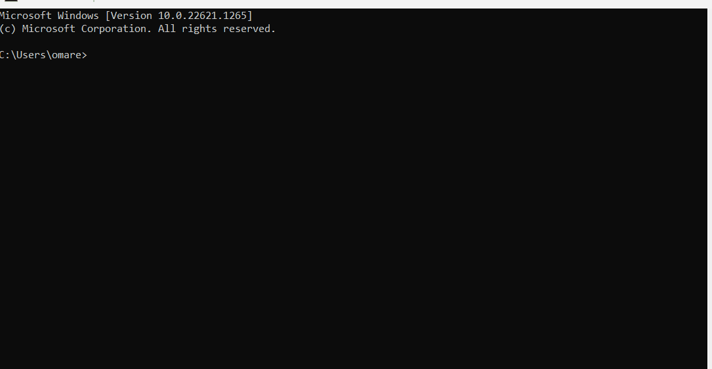
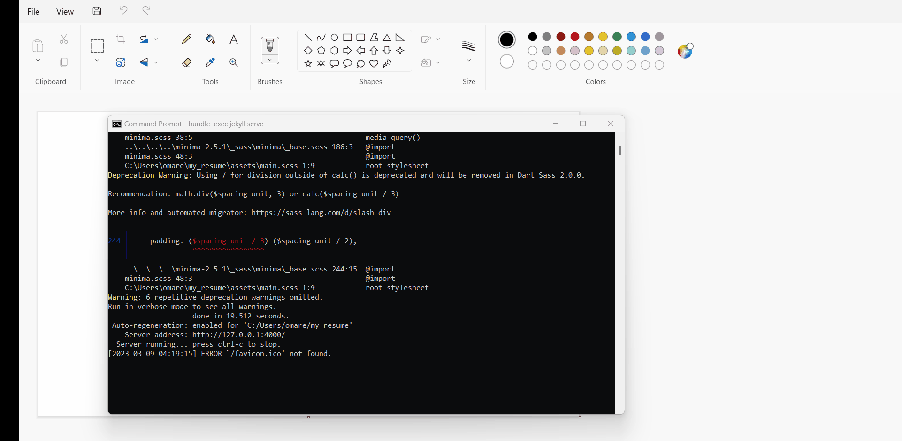

# Hosting Resume On GitHub Pages


## Purpose

#### The purpose of this tutorial is to show how to host your resume on Github using one of the static generator available like [Jekyll](https://jekyllrb.com/).


#### Main goals:
1.  Using markdown for writing your resume 
2.  Using Jekyll for building your static website
3.  Using GitHub to host your static website

## Prerequisites

### There are few prerequisites needed before you start 

##### 1.  GitHub account
   - [Click here to know how to create an account in GitHub](https://docs.github.com/en/get-started/signing-up-for-github/signing-up-for-a-new-github-account)

##### 2. Your resume ready 
   - [Here are good tips for writing a perfect resume](https://www.jobbank.gc.ca/findajob/resources/write-good-resume)

##### 3. Markdown text editor
 * In this tutorial, [VS studio code](https://code.visualstudio.com/) will b used

   
**_If you are struggling to find a free markdown editor,  [Obsidian](https://obsidian.md/) is completely free and it is very easy to use_**

# Getting started

### 1. Formatting a resume using Markdown
1. You need to install your Markdown text editor

2. If you are going to use VS code for writing your resume, you will need to create a new file with a .md extension and split your screen to get a preview and the script side by side, here is a short tutorial:
  

3. To know more about Markdown syntax, here are good resources for Markdown 
   1. [Markdown guide](https://www.markdownguide.org/)
   2. [Markdown tutorial](https://www.markdowntutorial.com/) **_Recommended_** 
   3. [CommonMark tutorial](https://commonmark.org/help/tutorial/) 

    &nbsp;

An awesome tip to consider while writing resume from _**Modtern Technical Writing, by Andrew Etter**_ 
1. **Consistency**: Always make all sections of your resume consistent with the same formatting
2. **Don't duplicate**: Break you resume into sections and don't duplicate

---

### 2. Install Jekyll
**Prerequisities:**
1. Check if you have the Ruby version 2.5.0 or higher
  - You can check using ```ruby-v ``` in your command line

  
  If you don't have it or it's not higher than 2.5.0, you can download it from here [Ruby version 2.5.0 or higher](https://www.ruby-lang.org/en/downloads/)

2. [RubyGems](https://rubygems.org/pages/download)
   - You can check using ```gcc -v ``` ,  ```g++ -v ``` in your command line ( if any is missing, you can download them from [here](https://gcc.gnu.org/install/)).


Now to install Jekyll, you need to write on the command line ```gem install jekyll bundler ```


---

### 3. Creating new Jekyll site
Now after installing Jekyll, we can start building a Jekyll site

 1. To create a new site, you will need to write this command ```jekyll new ``` follow by ```your project name ```

  

  2. Now you need to go to the new directory, so you will need the command ```cd ``` followed by ```your project name ```
  3. Now to compile the site that's already automatically generated by Jekyll, you will need this command  ```bundle exec jekyll serve ```
  
  4. You will get a link for the localhost port that your generated website is uploaded on, you will copy/paste this link to your browser
    


&nbsp;

# Building website

Now we have setup everything! It's the time to build your website.

1. Choosing your website theme 
   - Visit [rubygems.org](https://rubygems.org/).
   - Write on the search jekyll-theme-"then here write your theme"
   
   

2. Open the Jekyll folder that we have created already ``` On your Visual Studio Code: File > Open Folder > Select the folder  ``` 

**You can then customize the design and the layout of your generated website, but for our example, I will use a built-in theme**

3. We can now clone the repository theme that we have found on step 1. Keep on mind that there are few themes that can be deployed as a GitHub pages, [click here](https://pages.github.com/themes/) to know more about supported themes.
   - Clone the theme repository
      - Copy the repository link from Github
      - Go to Visual Studio, select Clone from Git
      - Select the folder in your local device to save the cloned repository
   - Install the packages for the theme
      - Open the terminal through Terminal > New Terminal
      -  Write the following command  ```bundle install```
   - Compile the website
     - On the same terminal, write the following command ```bundle exec jekyll serve```
   - Your themed website will be hosted on the local server, copy the link and paste it in your browser.


Here is more illustration for the process mentioned above:
   

# Hosting your resume

Now after having the site and theme ready, you will need just need to change the content of index.md to the resume.md that you  have built already.

1. Go to ```index.md``` or ```index.markdown``` 
2. Delete the content there after ```layout:default```
3. Paste the content of ```resume.md```
   
4. To delete the header, go to ```default.html``` and remove the content inside the tag ``` <header>``` 
5. Add this line into your "Gemfile" 
```gem "github-pages", "~> GITHUB-PAGES-VERSION", group: :jekyll_plugins```


# Uploading and hosting  on GitHub
1. Log in to your GitHub account.
2. Click on the plus icon in the top right corner of the screen and select "New repository".
3. Give your repository a name. It is recommended to use a name that reflects the purpose of your website, such as "myresume" or "resume-website".
4. Choose whether you want your repository to be public or private.
5. Check the box next to "Add a README file".
6. Click on the "Create repository" button.
7. upload all files created
8. [Setup github page](https://www.youtube.com/watch?v=QyFcl_Fba-k)
